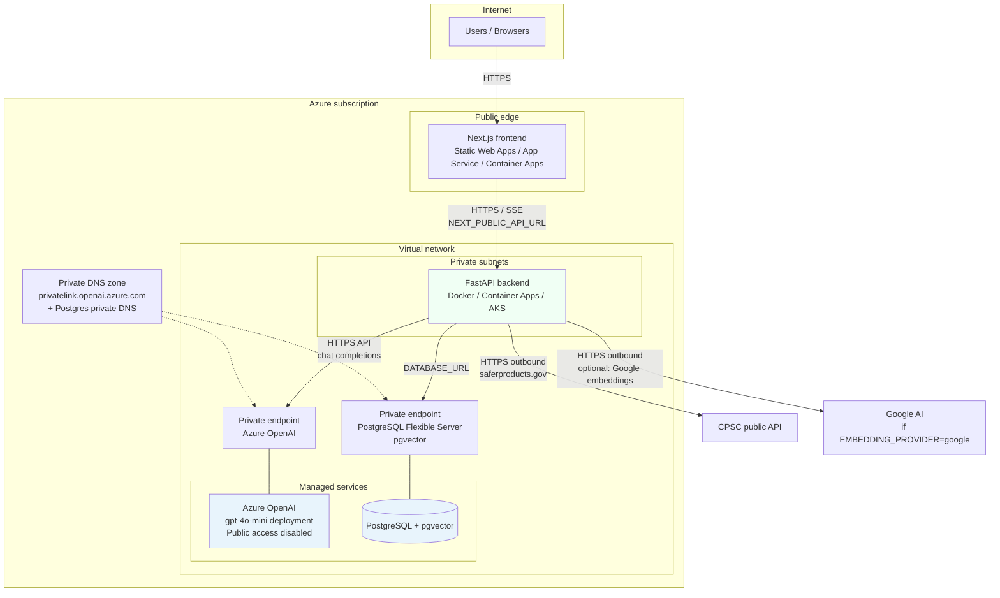

# CPSC Recalls Chatbot

AI-powered consumer product recall search and conversational assistant, powered by the U.S. Consumer Product Safety Commission (CPSC) recall database at saferproducts.gov.

## Features

- **Latest recalls** — Homepage shows the most recent CPSC recalls with hazard and remedy info
- **Semantic search** — Vector search over the indexed recall database (pgvector)
- **AI chat assistant** — Conversational RAG agent answers natural-language recall questions
- **Source citations** — Every assistant answer cites the specific recalls it used
- **Streaming responses** — Real-time token streaming for instant feedback
- **USWDS 3.x** — Fully compliant with U.S. Web Design System and Section 508

## Stack

| Layer | Technology |
|-------|-----------|
| Frontend | Next.js 15 + USWDS 3.x |
| Backend | Python FastAPI |
| LLM | OpenAI GPT-4o-mini (swappable via `LLM_PROVIDER`) |
| Vector DB | PostgreSQL 16 + pgvector |
| Recall Data | saferproducts.gov REST API |
| Containers | Docker + Docker Compose |

## Quick Start

### 1. Configure environment

```bash
cp .env.example .env
# Edit .env — minimum for Google-only:
#   GOOGLE_API_KEY — Gemini chat + text embeddings (RAG) + optional image description
# Optional: DATABASE_URL — use your Railway Postgres URL instead of the local `db` container
```

### 2. Start all services

```bash
docker compose up
```

The app will:
- Start PostgreSQL with pgvector
- Start the FastAPI backend (port 8000)
- Start the Next.js frontend (port 3000)
- Automatically pull recent CPSC recalls from saferproducts.gov on first boot
- Index recalls into pgvector for semantic search

Open http://localhost:3000

### 3. Trigger a full historical sync (optional)

```bash
curl -X POST http://localhost:8000/api/admin/ingest \
  -H "x-admin-key: dev-admin-key" \
  -H "Content-Type: application/json" \
  -d '{"full_sync": true}'
```

This fetches all CPSC recall data (30 years) and indexes it into pgvector. Takes ~10–20 minutes.

## Switching LLM Providers

Change `LLM_PROVIDER` in `.env` — no code changes needed:

```bash
# Google Gemini (default in .env.example — chat + embeddings with one key)
LLM_PROVIDER=google
LLM_MODEL=gemini-2.0-flash
GOOGLE_API_KEY=AIza...
EMBEDDING_PROVIDER=google

# OpenAI
LLM_PROVIDER=openai
LLM_MODEL=gpt-4o-mini
OPENAI_API_KEY=sk-...

# Anthropic Claude
LLM_PROVIDER=anthropic
LLM_MODEL=claude-3-5-haiku-20241022
ANTHROPIC_API_KEY=sk-ant-...

# Groq (fast, open models)
LLM_PROVIDER=groq
LLM_MODEL=llama-3.3-70b-versatile
GROQ_API_KEY=gsk_...

# Ollama (self-hosted, no API key)
LLM_PROVIDER=ollama
LLM_MODEL=llama3.2
OLLAMA_BASE_URL=http://localhost:11434
```

**Text embeddings (RAG)** use `EMBEDDING_PROVIDER` separately: `google` (same `GOOGLE_API_KEY`, `models/text-embedding-004`, 1536 dims) or `openai` (`OPENAI_API_KEY`). Do not change embedding model or dimension after you have indexed data without re-ingesting.

## API Endpoints

| Method | Path | Description |
|--------|------|-------------|
| GET | `/api/recalls/latest` | Latest CPSC recalls |
| GET | `/api/recalls/search?q=...` | Semantic search |
| GET | `/api/recalls/{id}` | Single recall |
| POST | `/api/chat/session` | Create chat session |
| POST | `/api/chat/{token}` | Send message (streaming SSE) |
| GET | `/api/chat/{token}/history` | Chat history |
| POST | `/api/admin/ingest` | Trigger ingestion (requires admin key) |
| GET | `/api/admin/stats` | Ingestion statistics |
| GET | `/health` | Health check |

## Architecture

### Application (logical)

```
┌─────────────────────────────────────────────────────┐
│  Next.js Frontend (USWDS 3.x, 508 compliant)        │
│  ├── / (Latest recalls + keyword search)            │
│  └── /chat (Conversational AI assistant)            │
└────────────────────┬────────────────────────────────┘
                     │ HTTP / SSE
┌────────────────────▼────────────────────────────────┐
│  FastAPI Backend                                     │
│  ├── /api/recalls  (search, latest, detail)         │
│  ├── /api/chat     (session, message, history)      │
│  └── /api/admin    (ingest trigger, stats)          │
│                                                     │
│  Services:                                          │
│  ├── CPSC API Client (saferproducts.gov)            │
│  ├── Vector Store (pgvector similarity search)      │
│  ├── LLM Provider (OpenAI / Anthropic / Groq / Ollama) │
│  ├── RAG Chain (LangChain, conversational memory)   │
│  └── Ingestion Scheduler (APScheduler, every 6h)   │
└────────────────────┬────────────────────────────────┘
                     │
┌────────────────────▼────────────────────────────────┐
│  PostgreSQL 16 + pgvector                           │
│  ├── recalls (CPSC recall records)                  │
│  ├── recall_embeddings (1536-dim vectors)           │
│  ├── chat_sessions + chat_messages                  │
│  └── ingestion_jobs (audit trail)                   │
└─────────────────────────────────────────────────────┘
```

### Azure deployment (secure: VNet + private Azure OpenAI)

**Yes — this is the right pattern.** Put the **backend container** in a **private subnet** (Azure Container Apps with VNet, Azure Kubernetes Service, App Service with VNet integration, or Container Instances in a subnet). Attach a **private endpoint** to your **Azure OpenAI** resource, link a **Private DNS zone** for `privatelink.openai.azure.com` to that VNet, and **disable public network access** on the OpenAI resource when your policy allows. The backend then calls the same deployment (`AZURE_OPENAI_DEPLOYMENT`) over **private connectivity** — LLM traffic stays on the Microsoft backbone, not the public internet.

Also use a **private endpoint** (or service firewall rules) for **Azure Database for PostgreSQL** with the **pgvector** extension, and expose only the **frontend** (and optionally an **Application Gateway / API Management** front door) to the internet over HTTPS.



**Configuration notes**

| Setting | Purpose |
|--------|---------|
| `AZURE_OPENAI_ENDPOINT` | Use the resource endpoint from Azure AI Foundry; with Private Link, ensure the container subnet uses the private DNS zone so this hostname resolves to the **private** IP. |
| `AZURE_OPENAI_API_KEY` | Store in **Azure Key Vault** and inject via managed identity (recommended). |
| `DATABASE_URL` | Connection string to **Azure PostgreSQL** over private connectivity (no public IP on the DB). |
| `CORS_ORIGINS` | Your production frontend origin only. |
| Outbound | Backend still needs egress to **saferproducts.gov** (ingestion) and, if used, **Google** / **OpenAI** for embeddings — lock down with **NAT Gateway + firewall rules** or **service-specific egress controls** per your security baseline. |

**What this does *not* replace:** defense in depth still requires managed identities, Key Vault, least-privilege RBAC, and monitoring. VNet + private endpoint removes exposure of the OpenAI inference endpoint to the public internet from your architecture’s perspective.

**Frontend → backend path:** If the API has **no public IP**, browsers cannot call it directly. Use **Application Gateway** (or **API Management**) with a **private** backend pool to the container, **Azure Front Door** + origin in a secured pattern, or host the Next.js app **in the same VNet** (e.g. private Container App) and expose only that tier. Set `NEXT_PUBLIC_API_URL` to the **public hostname** that terminates TLS and forwards to the private backend.

Planned UX for linking chat counts to a filterable recall list: [docs/advanced-search-plan.md](docs/advanced-search-plan.md).

**Azure Container Apps (Bicep):** Use `infra/main.bicepparam.example` as a template; copy to `infra/main.bicepparam` locally (gitignored, may contain secrets). See [infra/README.md](infra/README.md).

## Data Source

All recall data is sourced from the publicly available CPSC REST API:
- **Base URL**: https://www.saferproducts.gov/RestWebServices/Recall
- **Format**: JSON
- **Coverage**: Consumer product recalls from ~1974 to present
- **Updates**: Automatically re-synced every 6 hours

## Compliance

- **Section 508 / WCAG 2.1 AA** — Semantic HTML, ARIA labels, keyboard navigation, 4.5:1 contrast
- **USWDS 3.x** — Official U.S. Web Design System components
- **Plain language** — AI responses target 8th grade reading level
- **No PII collected** — Sessions are anonymous; no user accounts required
